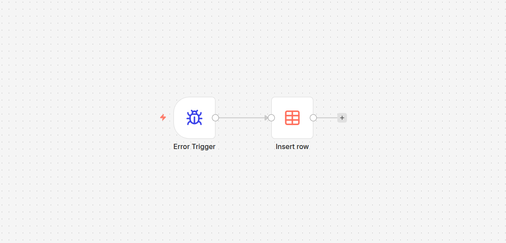
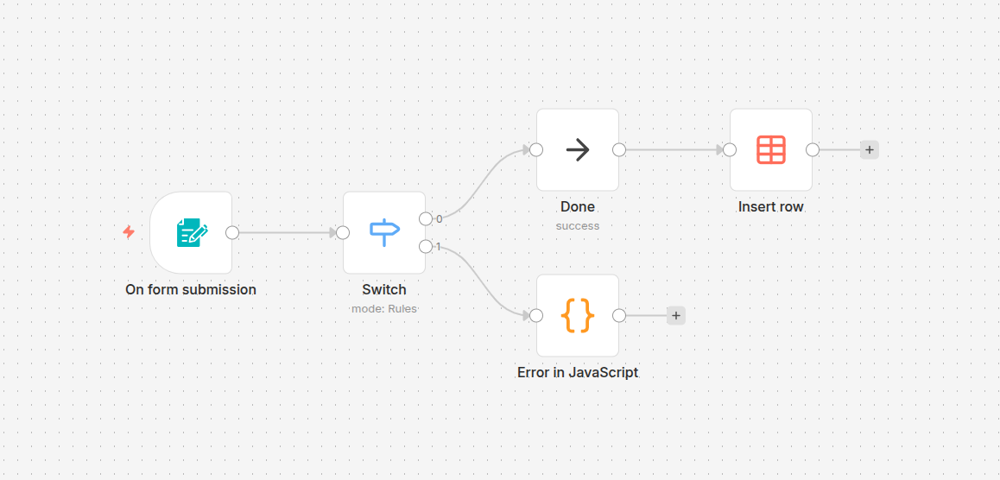
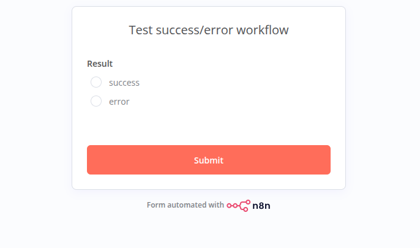
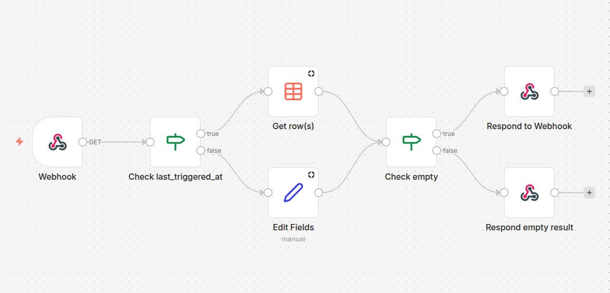

# n8n Integration for Home Assistant

Connect Home Assistant to your n8n instance. This integration discovers active workflows, exposes webhook triggers as buttons you can press from Home Assistant, and lists trigger endpoints and forms in the **n8n triggers** list.

## Features

- Creates a button entity for every `webhook` node in your active n8n workflows so you can fire the webhook from Home Assistant.
- Exposes a read-only triggers list entity that enumerates webhook and form triggers; form triggers include the generated form URL for convenience.
- Uses Home Assistant's config flow (UI setup) with validation against your n8n API.

## Requirements

- A reachable n8n base URL (for example, https://n8n.example.com).
- An n8n API token with permission to read workflows.
- tested with recent core build

## Installation

### Option 1: HACS (recommended)

1. In HACS, add this repository as a custom integration: `https://github.com/libstash/n8n-integration`.
2. Install **n8n Integration** from the Integrations section.
3. Restart Home Assistant.

### Option 2: Manual copy

1. Download this repository.
2. Copy the `custom_components/n8n_integration` folder into your Home Assistant `custom_components` directory.
3. Restart Home Assistant.

## Configuration

1. In Home Assistant, go to Settings → Devices & Services → Add Integration.
2. Search for **n8n Integration** and select it.
3. Enter your n8n base URL and API token. The flow validates the token by fetching active workflows.
4. After setup, entities are created automatically. If you rotate credentials later, use the integration's Options to update the URL/token.

## Entities

- Buttons: One per `webhook` node in each active workflow. Pressing the button triggers the corresponding webhook in n8n.
- Triggers list: A read-only list named **n8n triggers** containing webhook and form triggers. Items show workflow and node names; form trigger items include the form URL in the description.

## Example: Active n8n Form Triggers

Add a Markdown card that lists links to available form triggers:

```jinja2
### Active n8n Form Triggers


 | Form name | Edit Workflow | Form Link |
| :--- | :--- | :--- |
 | {{ state.name }} | [✏️]({{ state.attributes.n8n_url}}/workflow/{{ state.attributes.workflow_id }}) | [📋]({{ state.attributes.form_url }}) |


*No active form triggers found.*

```

# Example: Notifications from n8n to HomeAssistant

Create HomeAssistant notifications for success/error results from workflows

## Data table

To store workflow outputs
Columns:

```
id,workflowId,workflowName,message,type,createdAt,updatedAt
```

## Error handler workflow

Handles error from other workflows and insert `error` output result into the Data table

[examples/Error handler.json](<examples/Error handler.json>)

## Success or error workflow

Example workflow that can output success or error.
To handle error in the workflow settings set the `Error Workflow (to notify when this one errors)` to the [# Error handler](#Error_handler)




[examples/Success or error.json](<examples/Success or error.json>)

## Notifications endpoint workflow

Responds to HomeAssistant with list of recent results from outputs.


[examples/Notifications endpoint](<examples/Notifications endpoint.json>)

## Create notifications

Create basic presistant notification for each logged Workflow output
Go to the _n8n Integration_ and select the `Notifications endpoint`

Then in Automations - Create auutomation with device. And add

```yaml
alias: Create notifications
description: ""
triggers:
  - trigger: state
    entity_id:
      - button.notifications_endpoint_webhook
    attribute: response
conditions: []
actions:
  - variables:
      messages: >-
        {{ state_attr('button.notifications_endpoint_webhook', 'response')
        }}
  - choose: []
    default:
      - repeat:
          for_each: "{{ messages }}"
          sequence:
            - data:
                message: "{{ repeat.item.message }}"
              action: notify.persistent_notification
mode: single
```

## Trigger Notifications Webhook repitedly

```yaml
alias: Trigger Notifications Webhook Every Minute
description: Automatically press button.notifications_endpoint_webhook every minute
triggers:
  - minutes: "*"
    trigger: time_pattern
actions:
  - target:
      entity_id: button.notifications_endpoint_webhook
    action: button.press
mode: single
```

## How it works

- The integration pulls active workflows from `GET /api/v1/workflows?active=true` using your API token.
- Only webhook- and form-based triggers are surfaced; other node types are ignored.

## Troubleshooting

- Auth errors: Confirm the API token is valid and belongs to the provided n8n URL.
- Connection errors: Ensure Home Assistant can reach the n8n URL (network, SSL, reverse proxy).
- Missing entities: Verify the workflows are active and contain `webhook` or `formTrigger` nodes.
